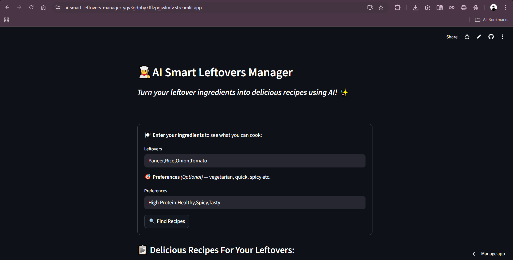
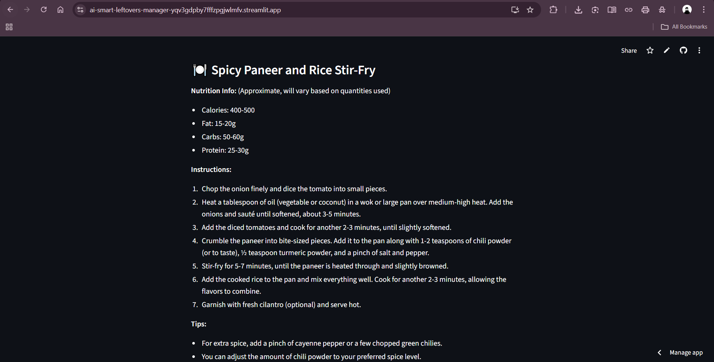
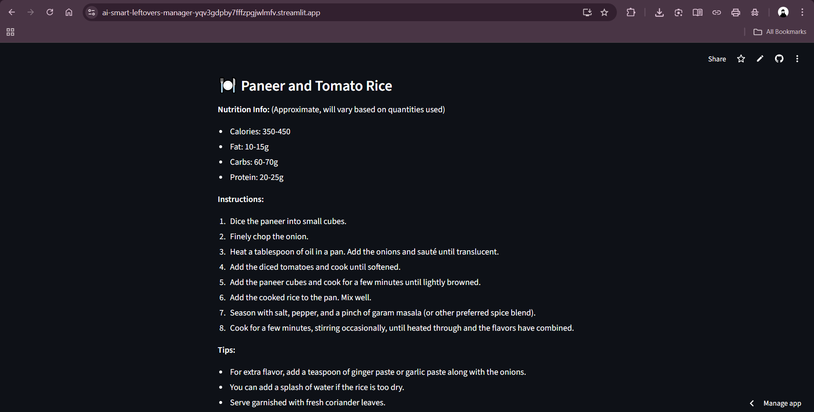

<h1 align="center">🍱 AI Smart Leftovers Manager</h1>

<p align="center">
  <a href="https://ai-smart-leftovers-manager-yqv3gdpby7fffzpgjwlmfv.streamlit.app">
    
  </a>
</p>

---

### 📌 About the Project

**AI Smart Leftovers Manager** is an AI-powered recipe recommendation tool built with Streamlit and Gemini (Google Generative AI).  
It helps you turn everyday leftover ingredients into tasty, personalized recipes – reducing food waste and making cooking fun and efficient.

---

### 📸 App Walkthrough

| 🧾 Input Form | 🍽️ Suggested Recipe-1 |
|--------------|----------------------|
|  |  |

| 🥗 Suggested Recipe-2 | 🧠 Suggested Recipe-3 |
|----------------|------------------------------|
|  |  |

---

### 🚀 Live App

👉 [Click here to try the app](https://ai-smart-leftovers-manager-yqv3gdpby7fffzpgjwlmfv.streamlit.app)

---


## 📂 Dataset

This app uses a curated version of the [recipes.csv] dataset from the Food.com dataset on Kaggle.  

- 📄 **Original Source**: [Kaggle – Food.com Recipes and Interactions](https://www.kaggle.com/datasets/irkaal/foodcom-recipes-and-reviews) 
- 🧹 **Cleaned Version Used**: Only essential columns such as recipe name, ingredients, and nutrition information are retained to optimize performance and improve results.

The cleaned dataset is included in the `data/RAW_recipes.csv` file.

---


### ✨ Features

- 🍅 Suggests recipes based on leftover ingredients
- 🧠 AI-generated step-by-step instructions using Gemini
- 📊 Nutrition details included per serving
- 🎨 Sleek modern UI with dark mode compatibility
- 💡 Supports preferences like vegetarian, spicy, quick, etc.

---

### ⚙️ Tech Stack

| Category       | Tools                             |
|----------------|-----------------------------------|
| Language       | Python 3.10+                      |
| AI Model       | Gemini 1.5 Flash (via LangChain)  |
| Web Framework  | Streamlit                         |
| NLP            | scikit-learn (TF-IDF)             |
| Libraries      | Pandas, LangChain, Google GenAI   |
| Hosting        | Streamlit Cloud                   |

---

### 💻 Run Locally

```bash
git clone https://github.com/Manwikkk/ai-smart-leftovers-manager.git
cd ai-smart-leftovers-manager
pip install -r requirements.txt
streamlit run app/ui_app.py

```

---

## 🔚 Conclusion

AI Smart Leftovers Manager helps reduce food waste by using powerful AI (Gemini) to turn your leftover ingredients into creative, healthy recipes. With a sleek interface, natural language prompts, and real-time Gemini-powered instructions and nutrition facts, it offers an intelligent way to make your meals smarter.

Whether you're a student, home cook, or someone looking to eat efficiently — this app makes cooking with leftovers fun, fast, and futuristic. 🍱✨

---

